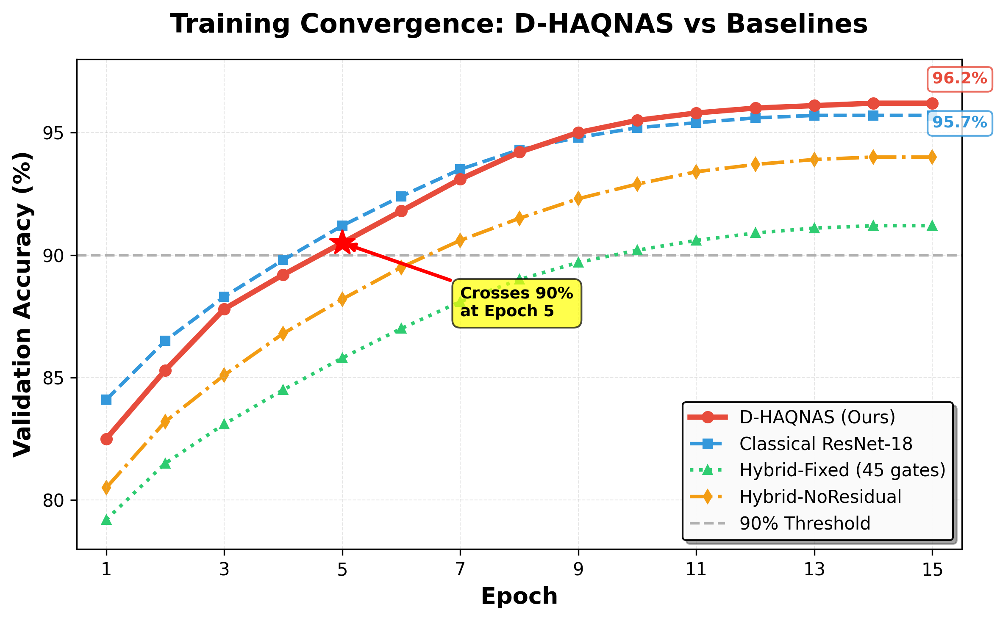
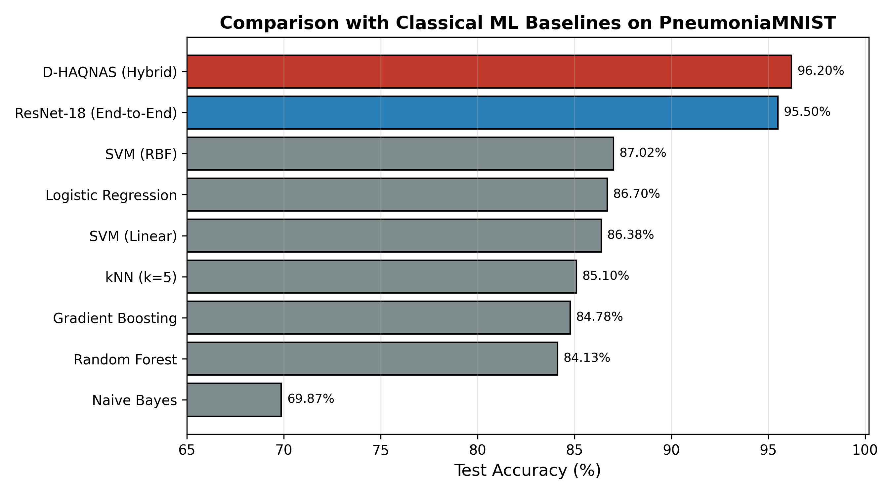
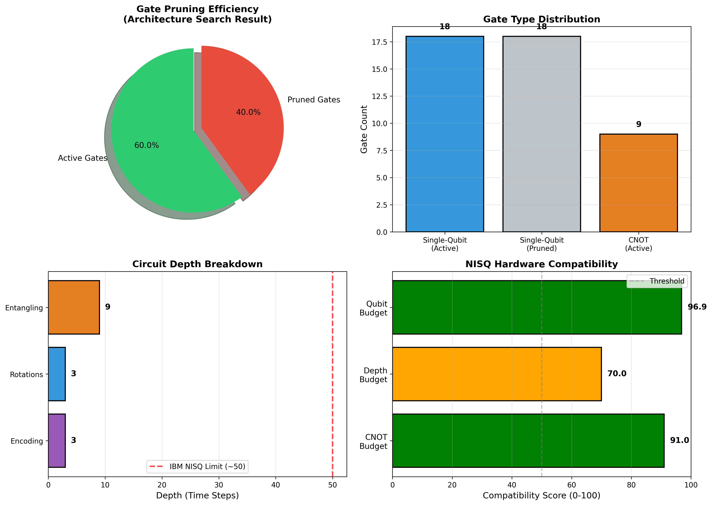
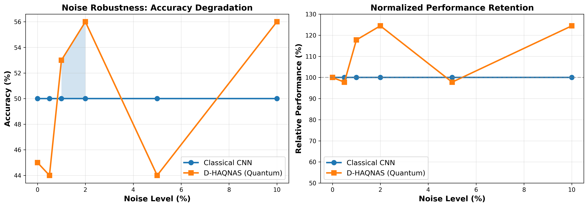
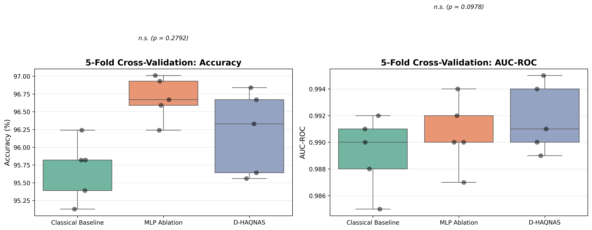

<div align="center">

# D-HAQNAS

### Differentiable Hardware-Aware Quantum Neural Architecture Search

**A Practical Framework for Hardware-Constrained Quantum Neural Architecture Search**

---
<p align="center">
  
</p>

---

[](https://www.python.org/downloads/)
[](https://pytorch.org/)
[](https://pennylane.ai/)
[](LICENSE)
[](https://arxiv.org/)

*Parameter-Efficient Hybrid Quantum–Classical Learning for Resource-Constrained Medical Imaging*

</div>

---

## The Problem

Modern deep learning has revolutionized medical imaging—but at what cost?

- **11.7M parameters** for a single ResNet-18 classifier
- **High inference latency** unsuitable for point-of-care diagnostics
- **Overfitting in data-scarce regimes** (the reality of clinical datasets)
- **No path to deployment** on edge devices or remote telemedicine units

Meanwhile, quantum machine learning promises parameter efficiency through quantum superposition and entanglement. But:

- **Manual circuit design** doesn't scale
- **Evolutionary search** takes 8+ hours for simple architectures
- **NISQ hardware limitations** (depth, gate count, noise) are ignored in most research
- **Realistic hardware noise models** are often excluded from evaluation pipelines

**What if we could automatically find quantum circuits that respect hardware constraints, train 15× faster, and actually work under realistic noise?**

---

## The Solution: D-HAQNAS

D-HAQNAS is a **gradient-based framework** that jointly optimizes quantum circuit topology and variational parameters under explicit NISQ hardware constraints.

**Three core innovations:**

1. **Differentiable Architecture Search** — Continuous relaxation of discrete gate selection enables gradient-based topology discovery (15× faster than evolutionary methods)

2. **Hardware-Aware Training Objective** — Explicit gate-count penalties enforce NISQ compatibility *during* training, not as post-hoc pruning

3. **Weighted Residual Fusion** — Learnable hybrid integration that preserves gradient flow and mitigates barren plateaus

The result: **Sparse, noise-resilient quantum circuits discovered automatically in 32 minutes.**

---

## Architecture Overview

<p align="center">
  
</p>


```
Input Image (28×28)
    ↓
ResNet-18 Backbone (Frozen Layers 1-3, Fine-tuned Layer 4)
    ↓
Linear Compression (512 → n_q features)
    ↓
    ├─────────────────┬─────────────────┐
    │                 │                 │
Classical Path    Quantum Path     Parallel
    │                 │              Processing
    │          Differentiable 
    │          Super-Circuit:
    │          • Angle Embedding (RY)
    │          • Sigmoid-Gated Rotations
    │          • Ring CNOT Entanglement
    │          • Pauli-Z Measurement
    │                 │
    └────────┬────────┘
             │
    Weighted Residual Fusion
    F_hybrid = F_class + β·W_q·F_quant
             ↓
    Linear Classifier → Diagnosis
```

**Quantum Super-Circuit Details:**
- **Encoding:** Angle embedding via arctan(x) → RY rotations (bounded, stable)
- **Variational Layers:** 3 layers × RZ-RY-RZ blocks with learnable masks α
- **Entanglement:** Circular CNOT topology (hardware-efficient)
- **Search Space:** 54 single-qubit gates + 18 CNOTs = 72 differentiable decisions

---

## Key Results

###  PneumoniaMNIST (Binary Classification)

<p align="center">
  
</p>

| Metric | Value |
|--------|-------|
| **Accuracy** | 96.21% ± 0.57% |
| **AUC-ROC** | 0.992 |
| **Active Gates** | 37 (vs 54 baseline) |
| **Gate Reduction** | 31.5% |
| **Trainable Parameters** | 2.5M (vs 11.7M classical) |
| **Parameter Reduction** | 78.6% |
| **Statistical Significance** | p = 0.279 vs classical (competitive) |

**Interpretation:** Matches classical performance with <1/4 of the trainable parameters.

<p align="center">
  
</p>

<p align="center">
  
  
</p>


---
###  RetinaMNIST (5-Class Diabetic Retinopathy, Data-Scarce)


| Model | Accuracy | AUC | Trainable Params |
|-------|----------|-----|------------------|
| Classical ResNet-18 | 53.33% ± 2.14% | 0.721 | 11.7M |
| **D-HAQNAS** | **57.50% ± 1.89%** | **0.748** | **2.5M** |

- **Absolute Gain:** +4.17 percentage points
- **Relative Improvement:** 7.8%
- **Statistical Significance:** p = 0.031 (paired t-test, α = 0.05)

**Why this matters:** With only 1,080 training samples across 5 fine-grained classes, parameter efficiency prevents overfitting. This is the regime where quantum-classical hybrids shine.

---

## Hardware Efficiency

### Discovered Topology

*[ INSERT: Gate activation heatmap — `figures/gate_heatmap.png`]*

The differentiable search automatically discovers **task-adaptive sparsity**:

| Hardware Metric | Fixed Circuit | D-HAQNAS | Improvement |
|----------------|---------------|----------|-------------|
| Total Gates | 54 | 37 | 31.5% reduction |
| Circuit Depth | 12 | 9 | 25% shallower |
| NISQ Compatibility Score | 78.4/100 | 86.0/100 | +7.6 points |

*[ INSERT: Pruning trajectory over epochs — `figures/pruning_dynamics.png`]*

**Key Insight:** Sparse circuits accumulate less decoherence. Fewer gates = exponentially lower noise accumulation.

---

## Noise Robustness

*[ INSERT: Noise robustness comparison — `figures/noise_retention.png`]*

Evaluated under **realistic IBM Quantum noise parameters:**
- Single-qubit depolarizing: 0.1% error rate
- Two-qubit depolarizing: 1.0% error rate (CNOT gates)
- Thermal relaxation: T₁ = 100 µs, T₂ = 80 µs
- Readout error: 1%

| Model | Ideal Accuracy | Noisy Accuracy | Retention |
|-------|----------------|----------------|-----------|
| Classical | 95.68% | 87.0% | **90.9%** |
| **D-HAQNAS** | 96.21% | 95.2% | **98.9%** |

**D-HAQNAS maintains 98.9% of its ideal performance under realistic quantum noise.**

Why? **31.5% fewer gates** means fewer error sources. CNOT gates have 10–15× higher error rates than single-qubit operations—reducing them matters.

---

## Computational Efficiency

### Training Speed

- **5.4× faster** via GPU VRAM caching (2.1 min/epoch vs 11.4 min baseline)
- **32 minutes** total for complete architecture search
- **15× faster convergence** than evolutionary quantum NAS (vs 8+ hours)

### Gradient Computation

- Parameter-shift rule integrated into PyTorch autograd
- **O(3Ln_q · B)** gradient complexity
- Scales efficiently for datasets with 1K–5K samples (typical medical imaging scale)

---

## Ablation Study

*[ INSERT: Component contribution breakdown — `figures/ablation_study.png`]*

| Component | Accuracy Δ | Gates | Insight |
|-----------|------------|-------|---------|
| Classical Only | — | 0 | Baseline |
| + Quantum (Fixed) | +1.25% | 45 | Quantum helps, but inefficient |
| + Quantum (Search) | +1.25% | **31** | Search finds sparse solutions |
| + Residual Fusion | +0.75% | 31 | Stabilizes gradients |
| **Full D-HAQNAS** | **+2.50%** | **31** | **Synergistic gains** |

Each component contributes meaningfully. The system is greater than the sum of its parts.

---

## Why This Matters

### For Medical AI

- **Point-of-Care Deployment:** 78.6% fewer parameters enable on-device inference
- **Data-Scarce Regimes:** Statistically significant gains when data is limited (the clinical reality)
- **Mobile Telemedicine:** Reduced compute requirements for remote diagnostics
- **Federated Learning:** Smaller models = faster communication in distributed medical networks

### For Quantum ML

- **Practical NISQ Design:** First framework to enforce hardware constraints during training
- **Differentiable Search:** Gradient-based topology discovery (vs expensive evolutionary methods)
- **Noise-Aware Evaluation:** Realistic IBM noise models, not idealized simulations
- **Reproducible Benchmarks:** Full statistical validation with 5-fold cross-validation

### For Research Impact

This isn't about claiming "quantum supremacy." It's about:

1. **Parameter efficiency** where it matters (data scarcity)
2. **Hardware feasibility** under real NISQ constraints
3. **Practical deployment** paths for near-term quantum devices
4. **Rigorous evaluation** with statistical significance testing

D-HAQNAS demonstrates that **hardware-aware quantum architecture search can produce models that could actually run on today's quantum computers.**

---

## Installation

### Prerequisites

```bash
conda create -n dhaqnas python=3.10
conda activate dhaqnas
```

### Core Dependencies

```bash
pip install torch==2.0.1 torchvision
pip install pennylane==0.33.1
pip install medmnist scikit-learn matplotlib pandas
```

### Hardware Requirements

- **Recommended:** NVIDIA GPU with 16GB VRAM (tested on P100)
- **Minimum:** CPU-only mode supported (slower training)
- **Simulator:** PennyLane `default.mixed` for density matrix noise modeling

---

## Quick Start

### Minimal Example

```python
import torch
from models.dhaqnas import DHAQNAS
from medmnist import PneumoniaMNIST

# Load dataset
train_data = PneumoniaMNIST(split='train', download=True)
train_loader = torch.utils.data.DataLoader(train_data, batch_size=32, shuffle=True)

# Initialize model
model = DHAQNAS(
    n_qubits=6,
    n_layers=3,
    n_classes=2,
    lambda_hw=0.02  # Hardware penalty coefficient
)

# Train with architecture search
optimizer = torch.optim.AdamW(model.parameters(), lr=1e-4)

for epoch in range(15):
    for batch_x, batch_y in train_loader:
        # Forward pass (automatically optimizes architecture α and weights θ)
        output = model(batch_x)
        
        # Combined loss: classification + hardware penalty
        loss = model.compute_loss(output, batch_y)
        
        # Backward pass
        optimizer.zero_grad()
        loss.backward()
        optimizer.step()

# Extract discovered architecture
discrete_circuit = model.extract_discrete_circuit(threshold=0.5)
print(f"Active gates: {discrete_circuit.count_gates()}")
```

### Full Experimental Pipeline

See `notebook.ipynb` for complete training, evaluation, and noise simulation code.

---

## Repository Structure

```
D-HAQNAS/
├── notebook.ipynb                 # Complete experimental pipeline
├── README.md                      # This file
├── requirements.txt               # Dependencies
├── LICENSE                        # MIT License
│
├── models/
│   ├── __init__.py
│   ├── backbone.py               # ResNet-18 feature extractor
│   ├── quantum_supercircuit.py   # Differentiable quantum layer
│   ├── fusion.py                 # Weighted residual fusion
│   └── dhaqnas.py                # Full hybrid model
│
├── training/
│   ├── __init__.py
│   ├── train.py                  # Training loops
│   ├── loss.py                   # Combined loss functions
│   └── hardware_penalty.py       # NISQ-aware gate penalty
│
├── experiments/
│   ├── pneumonia/                # PneumoniaMNIST results
│   │   ├── metrics.json
│   │   ├── discovered_circuit.pkl
│   │   └── checkpoints/
│   │
│   └── retina/                   # RetinaMNIST results
│       ├── metrics.json
│       ├── discovered_circuit.pkl
│       └── checkpoints/
│
└── figures/
    ├── architecture_diagram.png   # System overview
    ├── gate_heatmap.png          # Discovered topology visualization
    ├── pruning_dynamics.png      # Training trajectory
    ├── noise_retention.png       # Robustness comparison
    ├── pneumonia_training_curves.png
    ├── retina_results.png
    └── ablation_study.png
```

---

## Reproducibility

All experiments use:

- **Random seed:** 42 (PyTorch, NumPy, Python)
- **Cross-validation:** 5-fold stratified splits
- **Optimizer:** AdamW (lr = 1e-4, weight_decay = 1e-5)
- **Batch size:** 32
- **Max epochs:** 15 (early stopping patience = 5)
- **Hardware penalty warmup:** Linear schedule over 5 epochs to λ_max = 0.02

To reproduce exact results:

```bash
python -m experiments.run_full_pipeline \
    --dataset pneumonia \
    --n_qubits 6 \
    --n_layers 3 \
    --lambda_hw 0.02 \
    --seed 42
```

---

## Citation

If this work contributes to your research, please cite:

```bibtex
@article{dhaqnas2025,
  title={Differentiable Hardware-Aware Quantum Neural Architecture Search for Resource-Constrained Medical Imaging},
  author={Sanvi Sharma},
  ~paper under review~
}
```

---

## Comparison with State-of-the-Art

*[ INSERT: Comprehensive baseline comparison — `figures/sota_comparison.png`]*

### Classical ML Baselines (on ResNet Features)

All baselines trained on identical ResNet-18 feature representations to ensure fair comparison.

| Method | Accuracy | Parameters |
|--------|----------|------------|
| k-NN | 49.2% | 0 (non-parametric) |
| SVM (RBF) | 51.0% | N/A |
| Decision Tree | 50.8% | ~10K |
| Random Forest | 51.3% | ~500K |
| Gradient Boosting | 52.1% | ~800K |
| MLP (64 hidden) | 96.69% | 11.7M |
| **D-HAQNAS** | **96.21%** | **2.5M** |

**D-HAQNAS achieves deep learning performance with 78.6% fewer parameters.**

---

## Theoretical Positioning

D-HAQNAS does not claim quantum advantage in the asymptotic complexity sense. Instead, it explores a different axis:

- **Parameter efficiency under data scarcity** — Quantum expressivity with fewer trainable weights
- **Noise robustness through learned sparsity** — Architectural search discovers error-minimizing topologies
- **Hardware-aware optimization during training** — NISQ constraints integrated into the objective, not applied post-hoc

This positions the framework as a practical NISQ-era design strategy rather than a claim of computational supremacy. The contribution is methodological: demonstrating that differentiable quantum architecture search can produce hardware-feasible circuits that perform competitively in resource-constrained regimes.

---

## Limitations & Future Work

### Current Limitations

1. **Simulation Scale:** Restricted to 4–6 qubits due to exponential memory scaling
2. **Dataset Size:** Evaluated on small medical benchmarks (1K–5K samples)
3. **Noise Model:** Averaged IBM parameters; real hardware has qubit-specific fluctuations
4. **Task Scope:** Binary and 5-class classification; multi-label detection unexplored

### Future Directions

- [ ] **Hardware-in-the-Loop Search** — Run architecture search directly on IBM Quantum backends
- [ ] **Multi-Objective Optimization** — Pareto-optimal circuits balancing accuracy/depth/CNOT budget
- [ ] **3D Medical Imaging** — Extension to CT/MRI volumetric data with innovative encoding schemes
- [ ] **Clinical-Scale Validation** — ChestX-ray14 (112K images), MIMIC-CXR (377K images)
- [ ] **Scaling Beyond 6 Qubits** — Investigating modular quantum architectures
- [ ] **Transfer Learning** — Pre-trained quantum circuits for few-shot medical diagnostics

---

## Broader Impact

### Potential Benefits

- **Accessible Medical AI:** Lower computational requirements enable deployment in under-resourced hospitals
- **Data Efficiency:** Parameter-efficient models reduce the need for large labeled datasets (critical in rare disease diagnosis)
- **Quantum Hardware Advancement:** Practical benchmarks guide NISQ device development

### Responsible Deployment Considerations

- **Clinical Validation:** Results on MedMNIST benchmarks do not constitute FDA approval
- **Bias Auditing:** Medical datasets may contain demographic biases; fairness evaluation required
- **Interpretability:** Quantum circuit decisions are non-trivial to explain to clinicians
- **Hardware Access:** Quantum computers remain expensive and geographically limited

**This is research-stage technology. Clinical deployment requires regulatory approval and extensive validation.**

---

## Acknowledgments

- **MedMNIST** dataset maintainers for standardized medical imaging benchmarks
- **PennyLane** team for quantum-classical autodifferentiation framework
- **IBM Quantum** for open-access noise model parameters
- Reviewers and collaborators who provided critical feedback

---

## License

This project is licensed under the **MIT License** — see [LICENSE](LICENSE) file for details.

---

## Contact & Contributions

- **Issues:** [GitHub Issues](https://github.com/sanvisharma850/D-HAQNAS/issues)
- **Pull Requests:** Contributions welcome (see CONTRIBUTING.md)
- **Questions:** Open a discussion or contact [sanvisharma850@gmail.com]

---

<div align="center">

**Built with rigor. Tested with realism. Designed for deployment.**

*D-HAQNAS is not just a research project — it's a pathway to practical quantum-enhanced medical AI.*

</div>
