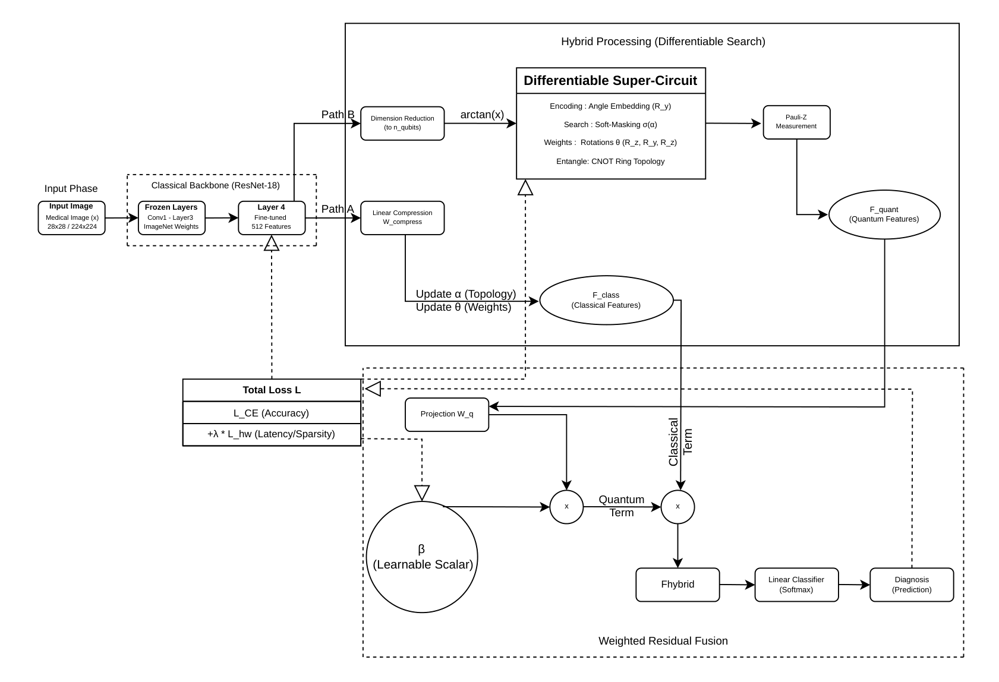

<div align="center">

<br>

```
██████╗       ██╗  ██╗ █████╗  ██████╗ ███╗  ██╗ █████╗ ███████╗
██╔══██╗      ██║  ██║██╔══██╗██╔═══██╗████╗ ██║██╔══██╗██╔════╝
██║  ██║█████╗███████║███████║██║   ██║██╔██╗██║███████║███████╗
██║  ██║╚════╝██╔══██║██╔══██║██║▄▄ ██║██║╚████║██╔══██║╚════██║
██████╔╝      ██║  ██║██║  ██║╚██████╔╝██║ ╚███║██║  ██║███████║
╚═════╝       ╚═╝  ╚═╝╚═╝  ╚═╝ ╚══▀▀═╝ ╚═╝  ╚══╝╚═╝  ╚═╝╚══════╝
```

### **Differentiable Hardware-Aware Quantum Neural Architecture Search**
#### *for Resource-Constrained Medical Imaging*

<br>

[](https://www.python.org/downloads/)
[](https://pytorch.org/)
[](https://pennylane.ai/)
[](LICENSE)
[](https://arxiv.org/)
[]()

<br>

> *A gradient-based framework that jointly optimizes quantum circuit topology and variational parameters under explicit NISQ hardware constraints — automatically discovering sparse, noise-resilient circuits in 32 minutes.*

<br>

</div>

---

## Table of Contents

- [Abstract](#abstract)
- [Motivation](#motivation)
- [Framework Overview](#framework-overview)
- [Architecture](#architecture)
- [Results](#results)
  - [PneumoniaMNIST](#pneumoniamnist-binary-classification)
  - [RetinaMNIST](#retinamnist-5-class-diabetic-retinopathy)
  - [Hardware Efficiency](#hardware-efficiency)
  - [Noise Robustness](#noise-robustness)
  - [Ablation Study](#ablation-study)
- [Comparison with State-of-the-Art](#comparison-with-state-of-the-art)
- [Installation](#installation)
- [Quick Start](#quick-start)
- [Reproducibility](#reproducibility)
- [Limitations & Future Work](#limitations--future-work)
- [Citation](#citation)

---

## Abstract

Quantum machine learning (QML) provides parameter-efficient substitutes for traditional deep networks in medical imaging settings with constrained computational resources. However, deployment on noisy intermediate-scale quantum (NISQ) devices is difficult due to manual architecture design and decoherence constraints, particularly when circuit depth is limited. We introduce **D-HAQNAS** — a differentiable hardware-aware framework that uses end-to-end differentiable optimization to find energy-efficient quantum topologies.

Our method outperforms evolutionary methods in architecture search by up to **15×**. Three essential elements are integrated: **(1)** a differentiable super-circuit with sigmoid-gated architectural parameters enabling gradient-based single-qubit gate topology search; **(2)** hardware-aware penalty terms that constrain gate count and circuit depth *during* training; and **(3)** weighted residual fusion to stabilize hybrid classical–quantum gradient flow.

D-HAQNAS achieves **96.21% accuracy** on PneumoniaMNIST — statistically comparable to classical baselines (p = 0.279) but with **78.6% fewer trainable parameters** and a **31.5% decrease in gate count** (54 → 37). On the severely data-limited RetinaMNIST benchmark (1,080 samples, 5-class diabetic retinopathy classification), D-HAQNAS demonstrates a statistically significant **+4.17 percentage point** improvement over classical models (57.50% vs. 53.33%, paired t-test p = 0.031), establishing parameter-efficient hybrid quantum-classical networks as a viable strategy for clinical settings constrained by data scarcity.

**Index Terms** — quantum machine learning, neural architecture search, NISQ devices, medical imaging, hybrid quantum-classical networks

---

## Motivation

Modern deep learning has transformed medical imaging — but deployment constraints remain severe:

| Challenge | Reality |
|---|---|
| **Parameter count** | ResNet-18 requires 11.7M parameters |
| **Inference latency** | Unsuitable for point-of-care diagnostics |
| **Data scarcity** | Clinical datasets routinely contain <5,000 samples |
| **NISQ constraints** | Circuit depth and gate count limits ignored by most QML research |
| **Architecture design** | Manual circuit design doesn't scale; evolutionary NAS takes 8+ hours |

QML promises parameter efficiency through quantum superposition and entanglement. However, existing approaches evaluate manually-constructed circuits under idealized, noise-free simulations — creating a fundamental gap between published results and NISQ hardware viability.

**D-HAQNAS closes this gap** by making hardware constraints a *training objective*, not a post-hoc filter.

---

## Framework Overview

Three core innovations define D-HAQNAS:

```
┌─────────────────────────────────────────────────────────────────┐
│  1. DIFFERENTIABLE ARCHITECTURE SEARCH                          │
│     Continuous relaxation of discrete gate selection via        │
│     sigmoid-gated α parameters — enables full gradient-based    │
│     topology discovery. 15× faster than evolutionary methods.   │
├─────────────────────────────────────────────────────────────────┤
│  2. HARDWARE-AWARE TRAINING OBJECTIVE                           │
│     Explicit gate-count penalties (λ·Lhw) enforce NISQ          │
│     compatibility during training. Linear warmup over 5 epochs  │
│     prevents premature pruning. CNOT gates weighted at cost 10  │
│     vs. single-qubit cost 1, reflecting real error rate ratios. │
├─────────────────────────────────────────────────────────────────┤
│  3. WEIGHTED RESIDUAL FUSION                                    │
│     F_hybrid = F_class + β·W_q·F_quant                         │
│     Learnable β (init 0.5) preserves classical gradient flow,   │
│     mitigates barren plateaus, and adaptively balances quantum  │
│     contribution per task (β ≈ 1.5 RetinaMNIST, β ≈ 0.5 Pneu.)│
└─────────────────────────────────────────────────────────────────┘
```

The combined training objective is:

```
L_total(α, θ) = L_CE(θ|α) + λ · L_hw(α)
```

where `α` denotes architectural gate-activation parameters, `θ` variational rotation weights, and `λ` is linearly warmed up from 0 → 0.02 over 5 epochs.

---

## Architecture
<p align="center">
  
</p>

### Differentiable Super-Circuit

The quantum branch implements a hardware-efficient variational ansatz with **L = 3 layers** over **n_q ∈ {4, 6} qubits**:

**Angle Embedding (per qubit i):**
```
RY(φᵢ),  φᵢ = arctan(fᵢ) ∈ (−π/2, π/2)
```
arctan preprocessing guarantees bounded, stable rotation angles independent of feature magnitude — unlike amplitude embedding which requires 2ⁿᵠ features with normalization constraints.

**Parameterized Rotation Block (per qubit i, layer l):**
```
U_rot^(l,i) = σ(α_{l,i,2}) RZ(θ_{l,i,2}) · σ(α_{l,i,1}) RY(θ_{l,i,1}) · σ(α_{l,i,0}) RZ(θ_{l,i,0})
```
where `σ(α) = (1 + e⁻ᵅ)⁻¹` is the sigmoid gate activation probability. Gates with `σ(α) ≥ 0.5` remain active; those below are pruned to identity. The RZ-RY-RZ sequence spans the full SU(2) group.

**Entangling Layer (fixed, not searchable):**
```
U_CNOT^(l) = ∏ CNOT(i, (i+1) mod n_q)
```
Ring CNOT topology is compatible with Google Sycamore and IBM heavy-hex hardware. Fixing entanglement maintains a tractable search space.

**Search Space:** For n_q = 6, L = 3: **54 differentiable single-qubit gates** + 18 fixed CNOT gates = 72 total decisions.

**Discrete Circuit Extraction:**
```
gate_{l,i,j} = active   if σ(α_{l,i,j}) ≥ 0.5
               pruned    if σ(α_{l,i,j}) < 0.5
```

**Gradient Computation** via parameter-shift rule:
```
∂/∂θ_{l,i,j} ⟨Ẑₖ⟩ = ½ [⟨Ẑₖ⟩_{θ+π/2} − ⟨Ẑₖ⟩_{θ−π/2}]
```
Complexity: **O(3Ln_q · B)** per batch, requiring two circuit evaluations per parameter.

**Trainable Parameter Count:**

| Component | Parameters |
|---|---|
| ResNet-18 Layer 4 (fine-tuned) | 1.5M |
| Quantum circuit (α + θ) | ~160 |
| Fusion layer (W_q, β) | ~3,300 |
| Classifier head | ~10 |
| **Total Trainable** | **2.5M** |
| Classical ResNet-18 (full) | 11.7M |
| **Reduction** | **78.6%** |

---

## Results

### PneumoniaMNIST (Binary Classification)

**Dataset:** 4,708 training / 624 test samples (28×28 grayscale chest X-rays, balanced binary classes). Evaluated via 5-fold stratified cross-validation.

| Model | Accuracy (%) | AUC-ROC | Total Params | Trainable Params |
|---|---|---|---|---|
| Classical ResNet-18 | 95.68 ± 0.41 | 0.989 | 11.7M | 11.7M |
| MLP Ablation | 96.69 ± 0.27 | 0.991 | 11.7M | 11.7M |
| **D-HAQNAS** | **96.21 ± 0.57** | **0.992** | **11.2M** | **2.5M** |

> **Paired t-test vs. Classical:** p = 0.279 (not significant — competitive parity)
> **Paired t-test vs. MLP:** p = 0.043 (MLP ablation edges D-HAQNAS on this well-powered dataset)

**Key takeaway:** D-HAQNAS matches classical performance in AUC (0.992) with 78.6% fewer trainable parameters. On large, balanced datasets, the primary gain is *parameter efficiency*, not raw accuracy. The MLP ablation remains competitive — this is expected, and the paper is transparent about it.

---

### RetinaMNIST (5-Class Diabetic Retinopathy)

**Dataset:** 1,080 training / 400 test samples (28×28 grayscale fundus images, ~216 samples per class). The most challenging MedMNIST benchmark due to extreme data scarcity and fine-grained class imbalance. Evaluated via 5-fold stratified cross-validation.

| Model | Accuracy (%) | AUC | Trainable Params |
|---|---|---|---|
| Classical ResNet-18 | 53.33 ± 2.14 | 0.721 | 11.7M |
| **D-HAQNAS** | **57.50 ± 1.89** | **0.748** | **2.5M** |

> **Absolute gain:** +4.17 percentage points
> **Relative improvement:** +7.8%
> **Paired t-test:** p = 0.031 ✓ (statistically significant at α = 0.05)

**Key takeaway:** Under severe data scarcity (1,080 samples, 5 classes), D-HAQNAS provides a *statistically significant* accuracy and AUC improvement. We attribute this primarily to the regularizing effect of parameter-efficient quantum processing, which reduces overfitting when training data is scarce. Whether this reflects parameter regularization or an intrinsic quantum effect remains an open research question.

---

### Hardware Efficiency

Circuit analysis on PneumoniaMNIST (n_q = 6):

| Metric | Fixed Topology | D-HAQNAS | Change |
|---|---|---|---|
| Total Possible Gates | 54 | 54 | — |
| Active Gates (post-search) | 54 | **37** | **−31.5%** |
| Circuit Depth | 12 | **9** | **−25%** |
| NISQ Compatibility Score | 78.4 / 100 | **86.0 / 100** | **+7.6 pts** |

The NISQ Compatibility Score is defined as `S = 100 × (1 − ē)`, where `ē` is the weighted average gate error rate using IBM Quantum parameters (p₁ = 0.1% single-qubit, p₂ = 1.0% two-qubit).

**Pruning dynamics:** Gate density declines from 100% (epoch 0) to 68.5% (epoch 15), stabilizing by epoch 10 following λ warmup completion. Architecture search runs in **32 minutes total** — **15× faster** than evolutionary quantum NAS (8+ hours).

---

### Noise Robustness

Evaluated using PennyLane `default.mixed` density matrix simulator with IBM Quantum device parameters:

| Noise Channel | Parameter |
|---|---|
| Single-qubit depolarizing | p₁ = 0.1% |
| Two-qubit depolarizing (CNOT) | p₂ = 1.0% |
| Thermal relaxation (T₁) | 100 µs (amplitude damping) |
| Thermal relaxation (T₂) | 80 µs (phase damping) |
| Readout misclassification | 1% |

Models are trained on ideal (noiseless) simulation and evaluated across four noise profiles: ideal, depolarizing-only, thermal-only, and IBM-realistic (combined).

| Model | Ideal Acc. | IBM-Realistic Acc. | Retention |
|---|---|---|---|
| Classical ResNet-18 | 95.68% | 87.0% | 90.9% |
| **D-HAQNAS** | **96.21%** | **95.2%** | **98.9%** |

> Retention = (Noisy Accuracy / Ideal Accuracy) × 100%

**D-HAQNAS achieves 98.9% performance retention under full IBM-realistic noise** — 8 percentage points above the classical baseline. The mechanism is direct: 31.5% fewer active gates means fewer decoherence sources. Since CNOT error rates are 10–15× higher than single-qubit gates, the architecture search's learned sparsity disproportionately reduces error accumulation.

---

### Ablation Study

Evaluated on RetinaMNIST with a simplified backbone (no Layer 4 fine-tuning) to isolate component contributions:

| Variant | Accuracy (%) | Active Gates | Δ Baseline |
|---|---|---|---|
| Classical Only | 48.50 | 0 | — |
| Quantum Only | 53.25 | 31 | +4.75% |
| Hybrid (Concatenation) | 50.25 | 31 | +1.75% |
| Hybrid (Fixed Topology) | 49.75 | 45 | +1.25% |
| **D-HAQNAS (Full)** | **51.00** | **31** | **+2.50%** |

> Note: Quantum Only (53.25%) > D-HAQNAS Full (51.00%) in the simplified backbone regime due to the compression bottleneck: without Layer 4 fine-tuning, classical features are weaker, and the n_q-dimensional compression layer creates an information bottleneck that pure quantum processing avoids. This anomaly disappears in the full model (Table II: 57.50%), confirming that Layer 4 fine-tuning resolves the bottleneck. The lower ablation range (48.50–51.00%) vs. main results (53.33–57.50%) confirms backbone sensitivity.

Each component contributes measurably. Residual fusion adds +0.75% over concatenation; architecture search adds +1.25% with a 31% gate reduction.

---

## Comparison with State-of-the-Art

All classical baselines trained on identical ResNet-18 512-dimensional feature representations to ensure fair comparison on PneumoniaMNIST:

| Method | Accuracy (%) | Trainable Params |
|---|---|---|
| Naïve Bayes | 69.87% | — |
| k-NN (k=5) | 85.10% | 0 (non-parametric) |
| SVM (Linear) | 86.38% | N/A |
| Logistic Regression | 86.70% | N/A |
| SVM (RBF) | 87.02% | N/A |
| ResNet-18 (End-to-End) | 95.50% | 11.7M |
| MLP (64 hidden units) | 96.69% | 11.7M |
| **D-HAQNAS (Hybrid)** | **96.21%** | **2.5M** |

Standard feature-based classifiers plateau at 69–87%. D-HAQNAS matches end-to-end ResNet fine-tuning with 78.6% fewer trainable parameters.

### Positioning Against Prior Quantum NAS

| Method | Search Strategy | Hardware Penalty | Noise Model | Medical Eval |
|---|---|---|---|---|
| DQAS (Zhang et al. 2022) | Differentiable relaxation | ✗ | Noiseless | ✗ |
| QuantumNAS (Wang et al. 2022) | Evolutionary | Post-hoc | Noise-adaptive | ✗ |
| **D-HAQNAS** | **Differentiable** | **✓ During training** | **IBM-realistic** | **✓ Statistical** |

To the best of our knowledge, D-HAQNAS is the first framework to combine: gradient-based gate topology search, hardware-penalty-constrained training, residual fusion for gradient stability, and statistically validated medical imaging evaluation under realistic IBM Quantum noise.

---

## Installation

**Prerequisites:**

```bash
conda create -n dhaqnas python=3.10
conda activate dhaqnas
```

**Core dependencies:**

```bash
pip install torch==2.0.1 torchvision
pip install pennylane==0.33.1
pip install medmnist scikit-learn matplotlib pandas
```

**Hardware requirements:**

| Tier | Specification |
|---|---|
| Recommended | NVIDIA GPU, 16GB VRAM (tested on P100) |
| Minimum | CPU-only (supported, slower) |
| Quantum simulator | PennyLane `default.mixed` (density matrix noise) |

---

## Quick Start

### Minimal Example

```python
import torch
from models.dhaqnas import DHAQNAS
from medmnist import PneumoniaMNIST

# Load dataset
train_data = PneumoniaMNIST(split='train', download=True)
train_loader = torch.utils.data.DataLoader(
    train_data, batch_size=32, shuffle=True
)

# Initialize model
# n_qubits=6 for PneumoniaMNIST, n_qubits=4 for RetinaMNIST
model = DHAQNAS(
    n_qubits=6,
    n_layers=3,
    n_classes=2,
    lambda_hw=0.02         # Hardware penalty coefficient (λ_max)
)

# Train with joint architecture + weight optimization
optimizer = torch.optim.AdamW(
    model.parameters(), lr=1e-4, weight_decay=1e-5
)

for epoch in range(15):
    for batch_x, batch_y in train_loader:
        output = model(batch_x)

        # L_total = L_CE(θ|α) + λ·L_hw(α)
        # Hardware penalty warmed up linearly over first 5 epochs
        loss = model.compute_loss(output, batch_y, epoch=epoch)

        optimizer.zero_grad()
        loss.backward()
        optimizer.step()

# Extract discrete NISQ-deployable circuit
discrete_circuit = model.extract_discrete_circuit(threshold=0.5)
print(f"Active gates: {discrete_circuit.count_gates()}")  # ~37 for PneumoniaMNIST
```

### Full Experimental Pipeline

See `notebook.ipynb` for the complete training, evaluation, ablation, and noise simulation pipeline.

---

## Reproducibility

All experiments use fixed random seed and standardized evaluation:

| Setting | Value |
|---|---|
| Random seed | 42 (PyTorch, NumPy, Python) |
| Cross-validation | 5-fold stratified |
| Optimizer | AdamW |
| Learning rate (η_α = η_θ) | 1 × 10⁻⁴ |
| Weight decay | 1 × 10⁻⁵ |
| Batch size | 32 |
| Max epochs | 15 |
| Early stopping patience | 5 epochs (validation loss) |
| λ warmup | Linear, 0 → 0.02 over 5 epochs |
| n_qubits | 6 (PneumoniaMNIST), 4 (RetinaMNIST) |
| n_layers | 3 |
| Quantum simulator | PennyLane `default.mixed` |

**Reproduce exact results:**

```bash
python -m experiments.run_full_pipeline \
    --dataset pneumonia \
    --n_qubits 6 \
    --n_layers 3 \
    --lambda_hw 0.02 \
    --seed 42

python -m experiments.run_full_pipeline \
    --dataset retina \
    --n_qubits 4 \
    --n_layers 3 \
    --lambda_hw 0.02 \
    --seed 42
```

---

## Limitations & Future Work

### Current Limitations

1. **Simulation scale:** Restricted to 4–6 qubits due to exponential memory scaling in statevector simulation.
2. **Dataset scale:** Validated on MedMNIST benchmarks (1,480–5,332 samples); benefits in data-scarce regimes may not transfer to clinical-scale datasets like ChestX-ray14 (112,120 images).
3. **Noise model:** Averaged IBM Quantum parameters; real hardware introduces qubit-specific calibration drift, crosstalk, and leakage beyond the averaged model.
4. **Search space scope:** Only single-qubit gate activations are optimized; CNOT entanglement topology is fixed.
5. **Task scope:** Binary and 5-class classification only; multi-label pathology detection is unvalidated.
6. **Quantum vs. classical attribution:** Whether RetinaMNIST gains reflect parameter regularization or an intrinsic quantum phenomenon remains an open question.

### Future Directions

- [ ] **Entanglement topology search** — extend NAS to CNOT connectivity, not just single-qubit activations
- [ ] **Hardware-in-the-loop** — run architecture search directly on IBM Quantum / Rigetti backends
- [ ] **Multi-objective Pareto optimization** — balance accuracy, circuit depth, and CNOT budget
- [ ] **Clinical-scale validation** — ChestX-ray14 (112K), MIMIC-CXR (377K)
- [ ] **Multi-label pathology classification** — extend beyond ordinal/binary tasks
- [ ] **3D medical imaging** — CT/MRI volumetric encoding schemes
- [ ] **Beyond 6 qubits** — modular quantum architectures, tensor-network inspired designs
- [ ] **Transfer learning** — pre-trained quantum circuits for few-shot diagnostics

### Theoretical Positioning

D-HAQNAS does not claim quantum computational advantage in the asymptotic complexity sense. The contribution is methodological: demonstrating that differentiable quantum architecture search can produce hardware-feasible circuits that perform competitively in resource-constrained regimes, exploring parameter efficiency under data scarcity, noise robustness through learned sparsity, and hardware-aware optimization as an integrated training objective rather than a post-hoc constraint.

---

## Broader Impact

**Potential benefits:** Lower computational requirements enable deployment in under-resourced hospitals and remote telemedicine units. Parameter-efficient models reduce the need for large labeled datasets, critical for rare disease diagnosis. Practical benchmarks on realistic noise models can guide near-term quantum hardware development.

**Responsible deployment considerations:** Results on MedMNIST benchmarks do not constitute regulatory approval. Medical datasets may reflect demographic biases requiring explicit fairness auditing. Quantum circuit decisions are non-trivial to explain to clinical practitioners. Quantum hardware remains expensive and geographically concentrated.

> **This is research-stage technology. Clinical deployment requires regulatory approval, extensive prospective validation, and interpretability analysis.**

---

## Citation

If D-HAQNAS contributes to your research, please cite:

```bibtex
@article{sharma2026dhaqnas,
  title   = {Differentiable Hardware-Aware Quantum Neural Architecture Search
             for Resource-Constrained Medical Imaging},
  author  = {Sharma, Sanvi},
  journal = {arXiv preprint},
  year    = {2026},
  note    = {Under review}
}
```

---

## Acknowledgments

- **MedMNIST** maintainers for standardized, reproducible medical imaging benchmarks
- **PennyLane** team for quantum-classical autodifferentiation infrastructure
- **IBM Quantum** for open-access noise model parameters used in robustness evaluation
- The authors of **DARTS** and **DQAS**, whose differentiable relaxation formulations informed this work

---

## License

MIT License — see [LICENSE](LICENSE) for details.

---

## Contact

**Issues & Bugs:** [GitHub Issues](https://github.com/sanvisharma850/D-HAQNAS/issues)  
**Contributions:** Pull requests welcome — see `CONTRIBUTING.md`  
**Correspondence:** [sanvisharma850@gmail.com](mailto:sanvisharma850@gmail.com)

---

<div align="center">

*Gradient-based. Hardware-constrained. Statistically validated.*

**D-HAQNAS establishes a practical path toward parameter-efficient medical inference on near-term quantum hardware.**

</div>
